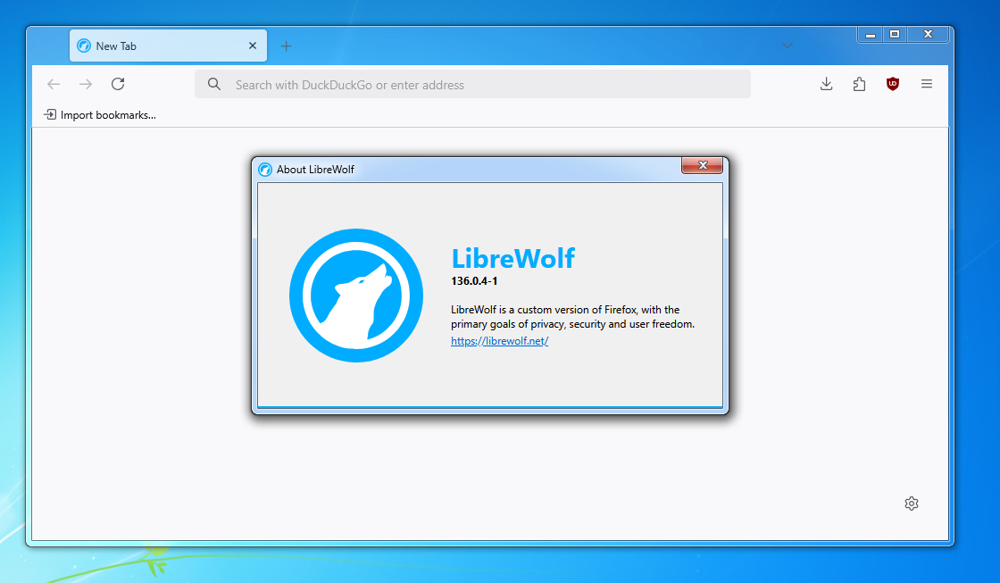
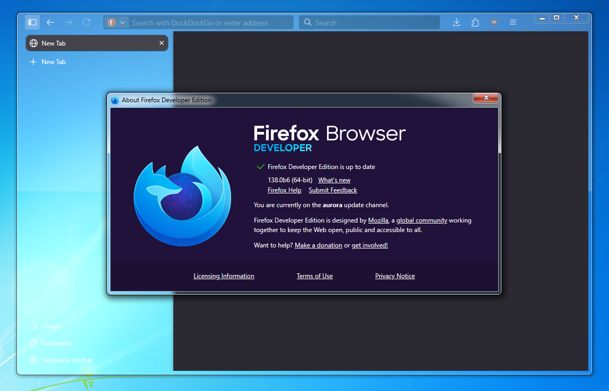

# Firefox Native Titlebar

A Windhawk mod to bring back the native titlebar on the latest version of Firefox.

The titlebar buttons are fully functional, both when the window is maximized and isn't.

## Installation steps

1. On your Firefox profile, make sure that in `about:config`, those properties are set:

|Property Name|Type|Value|
|--|--|--|
|`toolkit.legacyUserProfileCustomizations.stylesheets`|Boolean|`true`|

2. Then, drag and drop the [`userChrome.css`](userChrome.css) file in this repo within the `chrome` folder of your Firefox profile folder
    - To open your profile's directory, open `about:profiles`, scroll down to the one that states it is in use, then click the "Open Directory" button next on the "Root Directory" line.
    - If the `chrome` folder does not exist, create it
    - If you already have a `userChrome.css`, simply rename the file in the repo to `firefoxNativeTitlebar.css`, and add this line at the very bottom of your already existing `userChrome.css` file:
        ```css
        @import "firefoxNativeTitlebar.css"
        ```

3. Open [Windhawk](https://windhawk.net/) (install it if it's not already present)

4. Click on "Create a new mod", then copy and paste everything included in the [`firefox-native-titlebar.wh.cpp`](firefox-native-titlebar.wh.cpp) file

5. Make sure "Enable mod" is checked, click on "Compile mod", and wait for it to compile.

6. Click on "Exit Editing Mode", then restart your browser

7. Enjoy!

## Screenshots


Running on [LibreWolf](https://librewolf.net/) version `136.0.4-1` (latest version as of April 2025)


Running on [Firefox Developer Edition](https://www.mozilla.org/en-US/firefox/developer/) `138.0b6` (latest version as of April 2025), with vertical tabs on

### Credits

- Theme: [Aero10 by vaporvance](https://www.deviantart.com/vaporvance/art/Aero10-for-Windows-10-1903-22H2-909711949)
- Glass effects: [OpenGlass](https://github.com/ALTaleX531/OpenGlass/)
- Window metrics: [Aero Window Manager](https://github.com/Dulappy/aero-window-manager/) (using configuration from theme)

## QNA

### 1. Will this work on Chrome/Edge/Any other Chromium based browser?

No, this mod is only made for Firefox and its forks.

### 2. Is this required for Firefox ESR 115?

No, this version of Firefox still contains the old Win7 era titlebar code. To activate it, look for a corresponding `userChrome.css` file.

### 3. The titlebar buttons are invisible on my fork of Firefox

On Windhawk, add your fork's executable to the mod's custom include list.

This mod only applies to LibreWolf and Firefox by default.

## Known Bugs & Quirks

- [x] Maximizing the dev tools window makes its titlebar invisible
- [ ] Disabling the mod while your browser is open might lead to a crash
- [ ] Enabling the mod while your browser is open might lead to a crash upon closing
- [ ] This mod does not adjusts Firefox's stylesheet to properly fit the transparency, leading to some text being unreadable especially on light mode.
- [ ] The "Title Bar" option is pretty much broken now